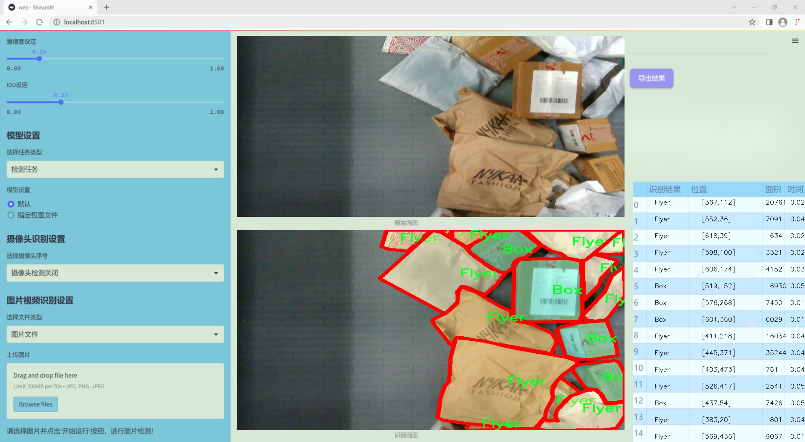
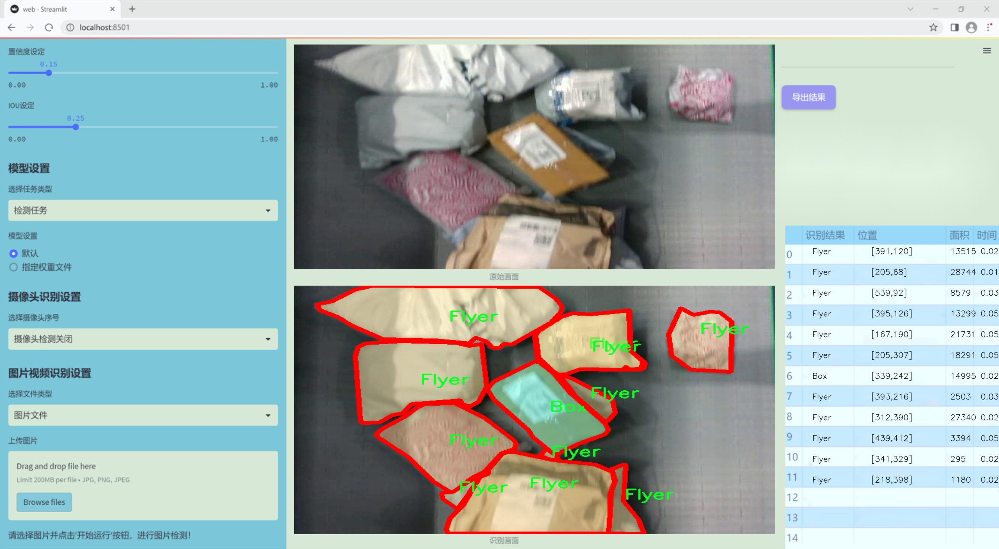
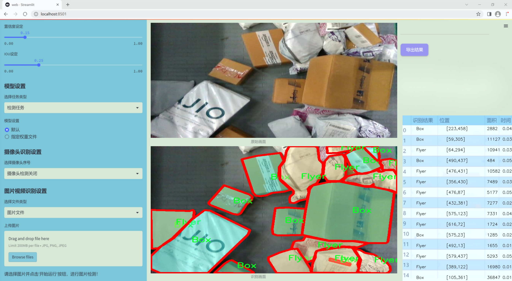
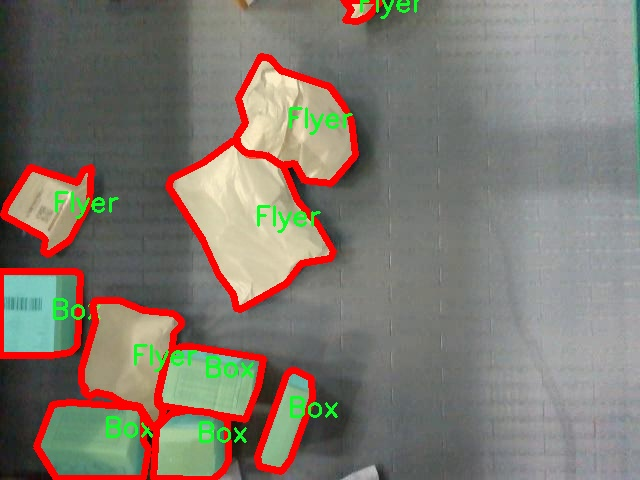
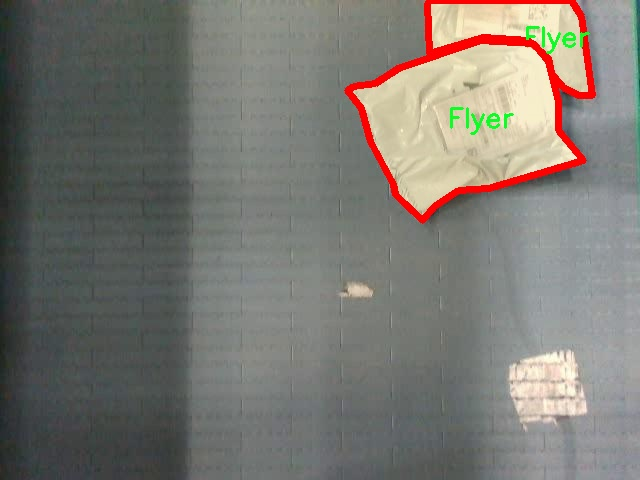
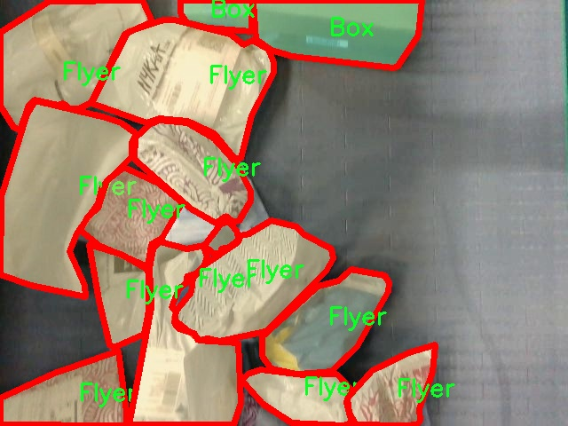
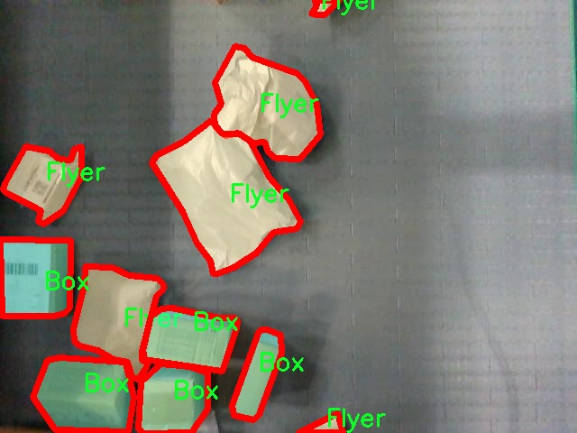
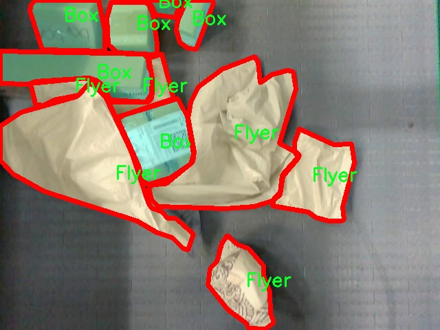

# 改进yolo11-CSwinTransformer等200+全套创新点大全：分拣线包装快递识别图像分割系统源码＆数据集全套

### 1.图片效果展示







##### 注意：由于项目一直在更新迭代，上面“1.图片效果展示”和“2.视频效果展示”展示的系统图片或者视频可能为老版本，新版本在老版本的基础上升级如下：（实际效果以升级的新版本为准）

  （1）适配了YOLOV11的“目标检测”模型和“实例分割”模型，通过加载相应的权重（.pt）文件即可自适应加载模型。

  （2）支持“图片识别”、“视频识别”、“摄像头实时识别”三种识别模式。

  （3）支持“图片识别”、“视频识别”、“摄像头实时识别”三种识别结果保存导出，解决手动导出（容易卡顿出现爆内存）存在的问题，识别完自动保存结果并导出到tempDir中。

  （4）支持Web前端系统中的标题、背景图等自定义修改。

  另外本项目提供训练的数据集和训练教程,暂不提供权重文件（best.pt）,需要您按照教程进行训练后实现图片演示和Web前端界面演示的效果。

### 2.视频效果展示

[2.1 视频效果展示](https://www.bilibili.com/video/BV1YZyVY2E2P/)

### 3.背景

##### 项目来源 [人工智能促进会 2024.10.20](https://kdocs.cn/l/cszuIiCKVNis)

研究背景与意义

随着电子商务的迅猛发展，快递行业的包裹处理量急剧增加，如何高效、准确地对快递进行分拣和包装已成为行业亟待解决的问题。传统的人工分拣方式不仅效率低下，而且容易出现错误，导致资源浪费和客户满意度下降。因此，开发一种智能化的分拣线包装快递识别系统显得尤为重要。基于改进YOLOv11的图像分割技术，能够有效提升快递包裹的识别和分类效率，具有广泛的应用前景。

本项目利用了一个包含1300张图像的数据集，专注于实例分割任务，主要分类包括“Box”和“Flyer”。这一数据集的构建为系统的训练和测试提供了丰富的样本，能够有效支持模型在不同场景下的应用。YOLOv11作为一种先进的目标检测算法，其高效性和准确性使其成为图像分割任务的理想选择。通过对YOLOv11进行改进，结合实例分割的需求，我们可以实现对快递包裹的精准识别与分割，从而提升分拣线的自动化水平。

此外，图像分割技术在快递行业的应用，不仅可以提高分拣效率，还能降低人力成本，减少人为错误，提升整体运营效率。随着技术的不断进步，基于深度学习的图像处理方法将在未来的快递行业中发挥越来越重要的作用。本项目的研究将为快递行业的智能化转型提供有力支持，同时也为相关领域的研究提供新的思路和方法。通过构建高效的分拣线包装快递识别系统，我们期望能够推动行业的发展，提升客户体验，实现经济效益与社会效益的双赢。

### 4.数据集信息展示

##### 4.1 本项目数据集详细数据（类别数＆类别名）

nc: 2
names: ['Box', 'Flyer']


该项目为【图像分割】数据集，请在【训练教程和Web端加载模型教程（第三步）】这一步的时候按照【图像分割】部分的教程来训练

##### 4.2 本项目数据集信息介绍

本项目数据集信息介绍

本项目所使用的数据集名为“2398_For_R&D”，旨在为改进YOLOv11的分拣线包装快递识别图像分割系统提供支持。该数据集包含了丰富的图像数据，专注于快递包装物品的识别与分割，尤其是针对两种主要类别的物品：箱子（Box）和传单（Flyer）。在快递行业中，快速、准确地识别和分类不同类型的包装物品对于提高分拣效率和降低错误率至关重要。因此，本数据集的构建不仅具有理论研究的意义，也为实际应用提供了重要的数据基础。

“2398_For_R&D”数据集共包含2个类别，分别是“Box”和“Flyer”。这两个类别的选择反映了现代快递行业中常见的包装形式，能够有效地模拟真实场景中的分拣需求。数据集中每个类别的样本数量经过精心设计，以确保模型在训练过程中能够充分学习到不同物品的特征和外观变化。图像数据的多样性体现在不同的拍摄角度、光照条件和背景环境，使得模型在实际应用中具备更强的鲁棒性和适应性。

此外，数据集中的图像经过标注处理，确保每个物品的边界清晰可辨，便于进行图像分割任务。通过使用该数据集，研究人员和开发者能够在YOLOv11模型的基础上，进一步优化算法性能，提升图像分割的准确性和效率。这不仅有助于实现更高效的快递分拣流程，也为未来的智能物流系统奠定了坚实的基础。总之，“2398_For_R&D”数据集为本项目的成功实施提供了重要的数据支持，助力于推动快递行业的智能化发展。











### 5.全套项目环境部署视频教程（零基础手把手教学）

[5.1 所需软件PyCharm和Anaconda安装教程（第一步）](https://www.bilibili.com/video/BV1BoC1YCEKi/?spm_id_from=333.999.0.0&vd_source=bc9aec86d164b67a7004b996143742dc)


[5.2 安装Python虚拟环境创建和依赖库安装视频教程（第二步）](https://www.bilibili.com/video/BV1ZoC1YCEBw?spm_id_from=333.788.videopod.sections&vd_source=bc9aec86d164b67a7004b996143742dc)

### 6.改进YOLOv11训练教程和Web_UI前端加载模型教程（零基础手把手教学）

[6.1 改进YOLOv11训练教程和Web_UI前端加载模型教程（第三步）](https://www.bilibili.com/video/BV1BoC1YCEhR?spm_id_from=333.788.videopod.sections&vd_source=bc9aec86d164b67a7004b996143742dc)


按照上面的训练视频教程链接加载项目提供的数据集，运行train.py即可开始训练



     Epoch   gpu_mem       box       obj       cls    labels  img_size
     1/200     20.8G   0.01576   0.01955  0.007536        22      1280: 100%|██████████| 849/849 [14:42<00:00,  1.04s/it]
               Class     Images     Labels          P          R     mAP@.5 mAP@.5:.95: 100%|██████████| 213/213 [01:14<00:00,  2.87it/s]
                 all       3395      17314      0.994      0.957      0.0957      0.0843

     Epoch   gpu_mem       box       obj       cls    labels  img_size
     2/200     20.8G   0.01578   0.01923  0.007006        22      1280: 100%|██████████| 849/849 [14:44<00:00,  1.04s/it]
               Class     Images     Labels          P          R     mAP@.5 mAP@.5:.95: 100%|██████████| 213/213 [01:12<00:00,  2.95it/s]
                 all       3395      17314      0.996      0.956      0.0957      0.0845

     Epoch   gpu_mem       box       obj       cls    labels  img_size
     3/200     20.8G   0.01561    0.0191  0.006895        27      1280: 100%|██████████| 849/849 [10:56<00:00,  1.29it/s]
               Class     Images     Labels          P          R     mAP@.5 mAP@.5:.95: 100%|███████   | 187/213 [00:52<00:00,  4.04it/s]
                 all       3395      17314      0.996      0.957      0.0957      0.0845


###### [项目数据集下载链接](https://kdocs.cn/l/cszuIiCKVNis)

### 7.原始YOLOv11算法讲解


2024年9月30日，Ultralytics在其活动YOLOVision中正式发布了YOLOv 11。YOLOv
11是由位于美国和西班牙的Ultralytics团队开发的YOLO的最新版本。YOLO是一种用于基于图像的人工智能的计算机模型。


YOLOv 11与其他版本的YOLO相比的性能

##### YOLOv11改进方向

与YOLOv10相比，YOLOv11有了巨大的改进，包括但不限于：

  * 增强的模型结构：模型具有改进的模型结构，以获取图像处理并形成预测

  * GPU优化：这是现代ML模型的反映，GPU训练ML模型在速度和准确性上都更好。

  * 速度：YOLOv 11模型现在经过增强和GPU优化以用于训练。通过优化，这些模型比它们的前版本快得多。在速度上达到了25%的延迟减少！

  * 更少的参数：更少的参数允许更快的模型，但v11的准确性不受影响

  * 更具适应性：更多支持的任务YOLOv 11支持多种类型的任务、多种类型的对象和多种类型的图像。

##### YOLOv11功能介绍

Glenn Jocher和他的团队制作了一个令人敬畏的YOLOv 11迭代，并且在图像人工智能的各个方面都提供了YOLO。YOLOv 11有多种型号，包括：

  * 对象检测-在训练时检测图像中的对象

  * 图像分割-超越对象检测，分割出图像中的对象

  * 姿态检测-当用点和线训练时绘制一个人的姿势

  * 定向检测（OBB）：类似于对象检测，但包围盒可以旋转

  * 图像分类-在训练时对图像进行分类

使用Ultralytics Library，这些模型还可以进行优化，以：

  * 跟踪-可以跟踪对象的路径

  * 易于导出-库可以以不同的格式和目的导出

  * 多场景-您可以针对不同的对象和图像训练模型

此外，Ultralytics还推出了YOLOv 11的企业模型，该模型将于10月31日发布。这将与开源的YOLOv
11模型并行，但将拥有更大的专有Ultralytics数据集。YOLOv 11是“建立在过去的成功”的其他版本的之上。

##### YOLOv11模型介绍

YOLOv 11附带了边界框模型（无后缀），实例分割（-seg），姿态估计（-pose），定向边界框（-obb）和分类（-cls）。

这些也有不同的尺寸：纳米（n），小（s），中（m），大（l），超大（x）。


YOLOv11模型

##### YOLOv11与前版本对比

与YOLOv10和YOLOv8相比，YOLOv11在Ultralytics的任何帖子中都没有直接提到。所以我会收集所有的数据来比较它们。感谢Ultralytics：

**检测：**


YOLOv11检测统计


YOLOv10检测统计

其中，Nano的mAPval在v11上为39.5，v10上为38.5；Small为47.0 vs 46.3，Medium为51.5 vs
51.1，Large为53.4 vs 53.2，Extra Large为54.7vs
54.4。现在，这可能看起来像是一种增量增加，但小小数的增加可能会对ML模型产生很大影响。总体而言，YOLOv11以0.3
mAPval的优势追平或击败YOLOv10。

现在，我们必须看看速度。在延迟方面，Nano在v11上为1.55 , v10上为1.84，Small为2.46 v2.49，Medium为4.70
v4.74，Large为6.16 v7.28，Extra Large为11.31
v10.70。延迟越低越好。YOLOv11提供了一个非常低的延迟相比，除了特大做得相当差的前身。

总的来说，Nano模型是令人振奋的，速度更快，性能相当。Extra Large在性能上有很好的提升，但它的延迟非常糟糕。

**分割：**


YOLOV11 分割统计


YOLOV9 分割统计


YOLOV8 分割数据

总体而言，YOLOv 11上的分割模型在大型和超大型模型方面比上一代YOLOv 8和YOLOv 9做得更好。

YOLOv 9 Segmentation没有提供任何关于延迟的统计数据。比较YOLOv 11延迟和YOLOv 8延迟，发现YOLOv 11比YOLOv
8快得多。YOLOv 11将大量GPU集成到他们的模型中，因此期望他们的模型甚至比CPU测试的基准更快！

**姿态估计：**


YOLOV11姿态估计统计


YOLOV8姿态估计统计

YOLOv 11的mAP 50 -95统计量也逐渐优于先前的YOLOv 8（除大型外）。然而，在速度方面，YOLOv
11姿势可以最大限度地减少延迟。其中一些延迟指标是版本的1/4！通过对这些模型进行GPU训练优化，我可以看到指标比显示的要好得多。

**定向边界框：**


YOLOv11 OBB统计


YOLOv8 OBB统计

OBB统计数据在mAP
50上并不是很好，只有非常小的改进，在某种程度上小于检测中的微小改进。然而，从v8到v11的速度减半，这表明YOLOv11在速度上做了很多努力。

**最后，分类：**


YOLOv 11 CLS统计


YOLOv8 CLS统计

从v8到v11，准确性也有了微小的提高。然而，速度大幅上升，CPU速度更快的型号。


### 8.200+种全套改进YOLOV11创新点原理讲解

#### 8.1 200+种全套改进YOLOV11创新点原理讲解大全

###### 由于篇幅限制，每个创新点的具体原理讲解就不全部展开，具体见下列网址中的创新点对应项目的技术原理博客网址【Blog】（创新点均为模块化搭建，原理适配YOLOv5~YOLOv11等各种版本）

[8.1 技术原理博客【Blog】网址链接](https://gitee.com/qunmasj/good)


#### 8.2 精选部分改进YOLOV11创新点原理讲解

###### 这里节选部分改进创新点展开原理讲解(完整的改进原理见上图和[技术博客链接](https://gitee.com/qunmasj/good))【如果此小节的图加载失败可以通过CSDN或者Github搜索该博客的标题访问原始博客，原始博客图片显示正常】
### YOLOv11简介
Yolov8主要借鉴了Yolov5、Yolov6、YoloX等模型的设计优点，其本身创新点不多，偏重在工程实践上，具体创新如下:
·提供了一个全新的SOTA模型（包括P5 640和P6 1280分辨率的目标检测网络和基于YOLACT的实例分割模型)。并且，基于缩放系数提供了N/S/M/IL/X不同尺度的模型，以满足不同部署平台和应用场景的需求。
●Backbone:同样借鉴了CSP模块思想，不过将Yolov5中的C3模块替换成了C2f模块，实现了进一步轻量化，同时沿用Yolov5中的SPPF模块，并对不同尺度的模型进行精心微调，不再是无脑式—套参数用于所有模型，大幅提升了模型性能。
●Neck:继续使用PAN的思想，但是通过对比YOLOv11与YOLOv11的结构图可以看到，YOLOv11移除了1*1降采样层。
●Head部分相比YOLOv11改动较大，Yolov8换成了目前主流的解耦头结构(Decoupled-Head)，将分类和检测头分离，同时也从Anchor-Based换成了Anchor-Free。
●Loss计算:使用VFLLoss作为分类损失(实际训练中使用BCE Loss);使用DFLLoss+ClOU Loss作为回归损失。
●标签分配: Yolov8抛弃了以往的loU分配或者单边比例的分配方式，而是采用Task-Aligned Assigner正负样本分配策略。
#### Yolov8网络结构
Yolov8模型网络结构图如下图所示。


#### Backbone
Yolov8的Backbone同样借鉴了CSPDarkNet结构网络结构，与Yolov5最大区别是，Yolov8使用C2f模块代替C3模块。具体改进如下:
·第一个卷积层的Kernel size从6×6改为3x3。
·所有的C3模块改为C2f模块，如下图所示，多了更多的跳层连接和额外Split操作。。Block数由C3模块3-6-9-3改为C2f模块的3-6-6-3。

### 上下文引导网络（CGNet）简介


高准确率的模型（蓝点），由图像分类网络转化而来且参数量大，因此大多不适于移动设备。
低分辨率的小模型（红点），遵循分类网络的设计方式，忽略了分割特性，故而效果不好。
#### CGNet的设计：
为了提升准确率，用cgnet探索语义分割的固有属性。对于准确率的提升，因为语义分割是像素级分类和目标定位，所以空间依赖性和上下文信息发挥了重要作用。因此，设计cg模块，用于建模空间依赖性和语义上下文信息。
- 1、cg模块学习局部特征和周围特征形成联合特征
- 2、通过逐通道重新加权（强调有用信息，压缩无用信息），用全局特征改善联合特征
- 3、在全阶段应用cg模块，以便从语义层和空间层捕捉信息。
为了降低参数量：1、深层窄网络，尽可能节约内存 2、用通道卷积


之前的网络根据框架可分三类：
- 1、FCN-shape的模型，遵循分类网络的设计，忽略了上下文信息 ESPNet、ENet、fcn
- 2、FCN-CM模型，在编码阶段后用上下文模块捕捉语义级信息 DPC、DenseASPP、DFN、PSPNet
- 3、（our）在整个阶段捕捉上下文特征
- 4、主流分割网络的下采样为五次，学习了很多关于物体的抽象特征，丢失了很多有鉴别性的空间信息，导致分割边界过于平滑，（our）仅采用三次下采样，利于保存空间信息


#### cg模块

Cg模块：
思路：人类视觉系统依赖上下文信息理解场景。
如图3,a， 如若仅关注黄色框框，很难分辨，也就是说，仅关注局部特征不容易正确识别目标的类别。 然后，如果加入了目标周围的特征，即图3,b，就很容易识别正确，所以周围特征对于语义分割是很有帮助的。在此基础上，如果进一步用整个场景的特征加以辅助，将会有更高的程度去争正确分类黄色框框的物体，如图3,c所示。 故，周围上下文和全局上下文对于提升分割精度都是有帮助的。


实现：基于此，提出cg模块，利用局部特征，周围上下文以及全局上下文。如图3,d所示。该模块共包含两个阶段。

第一步，floc( ) 局部和 fsur( )周围函数分别学习对应特征。floc( )用3x3卷积从周围8个点提取特征，对应于黄色框框；同时fsur( )用感受野更大的3x3带孔卷积学习周围上下文，对应红色框框。然后fjoi( )是指将前两路特征concat之后经BN，PReLU。此一部分是cg模块的第一步。
对于模块的第二步，fglo( )用于提取全局特征，改善联合特征。受SENet启发，全局上下文被认为是一个加权向量，用于逐通道微调联合特征，以强调有用元素、压缩无用元素。在本论文中，fglo( )用GAP产生聚合上下文特征，然后用多层感知机进一步提取全局上下文。最后，使用一个尺度层对联合特征重新加权用提取的全局上下文。
残差连接有利于学习更复杂的特征以及便于训练时梯度反向传播。两个拟设计方案，LRL局部残差连接和GRL全局残差连接，实验证明（消融实验），GRL效果更好

#### CGNet网络


原则：深、瘦（deep and thin）以节省内存。层数少，通道数少，三个下采样。

Stage1，三个标准卷积层，分辨率变成原来的1/2

Stage2和stage3，分别堆叠M和N个cg模块。该两个阶段，第一层的输入是前一阶段第一个和最后一个block的结合（how结合）利于特征重用和特征传播。

将输入图像下采样到1/4和1/8分别输入到第2和3阶段。

最后，用1x1卷积层进行分割预测。

为进一步降低参数量，局部和周围特征提取器采用了逐通道卷积。之前有的工作在逐通道卷积后采用1x1卷积用以改善通道间的信息流动，本文消融实验显示效果不好，分析：因为cg模块中提取的局部和全局特征需要保持通道独立性，所以本论文不使用1*1卷积。


### 9.系统功能展示

图9.1.系统支持检测结果表格显示

  图9.2.系统支持置信度和IOU阈值手动调节

  图9.3.系统支持自定义加载权重文件best.pt(需要你通过步骤5中训练获得)

  图9.4.系统支持摄像头实时识别

  图9.5.系统支持图片识别

  图9.6.系统支持视频识别

  图9.7.系统支持识别结果文件自动保存

  图9.8.系统支持Excel导出检测结果数据


### 10. YOLOv11核心改进源码讲解

#### 10.1 TransNext.py

以下是对您提供的代码进行逐行分析和注释后的核心部分：

```python
try:
    # 尝试导入swattention模块和TransNext_cuda中的所有内容
    import swattention
    from ultralytics.nn.backbone.TransNeXt.TransNext_cuda import *
except ImportError as e:
    # 如果导入失败（例如模块不存在），则导入TransNext_native中的所有内容
    from ultralytics.nn.backbone.TransNeXt.TransNext_native import *
    pass
```

### 代码分析与注释

1. **导入模块**：
   - `try`块用于尝试导入一些模块和类。
   - `import swattention`：尝试导入名为`swattention`的模块。这个模块可能是与注意力机制相关的实现。
   - `from ultralytics.nn.backbone.TransNeXt.TransNext_cuda import *`：尝试从`ultralytics`库中的`TransNeXt`模块导入所有内容，特别是CUDA实现的部分。这通常意味着该模块利用GPU加速来提高性能。

2. **异常处理**：
   - `except ImportError as e`：如果在`try`块中发生`ImportError`（即无法找到或导入指定的模块），则执行`except`块中的代码。
   - `from ultralytics.nn.backbone.TransNeXt.TransNext_native import *`：在导入CUDA实现失败的情况下，改为导入`TransNext_native`模块。这通常是CPU实现，作为备选方案以确保代码能够运行。
   - `pass`：在这里使用`pass`表示不执行任何操作，只是简单地捕获异常并继续执行后续代码。

### 核心逻辑
- 该代码的核心逻辑是根据环境的不同选择合适的模块进行导入，以确保在不同的硬件条件下（如是否支持CUDA）都能正常运行。这种做法在深度学习和机器学习项目中非常常见，因为它们通常需要在不同的计算平台上进行适配。

这个程序文件 `TransNext.py` 的主要功能是导入一个名为 `swattention` 的模块，并尝试从 `ultralytics` 库中导入 `TransNext_cuda` 模块。如果在导入 `TransNext_cuda` 时发生 `ImportError`（即找不到该模块），程序会捕获这个异常，并尝试导入 `TransNext_native` 模块作为替代。

具体来说，首先，程序使用 `try` 语句块来尝试执行导入操作。如果 `TransNext_cuda` 模块能够成功导入，那么程序将继续执行这个模块中的功能。如果导入失败，程序会进入 `except` 块，捕获到 `ImportError` 异常，然后导入 `TransNext_native` 模块。

这种设计的目的是为了提高代码的兼容性和灵活性。在某些环境中，可能没有 CUDA 支持，导致 `TransNext_cuda` 模块无法导入。在这种情况下，程序会自动回退到 `TransNext_native` 模块，确保程序仍然能够运行。

总的来说，这段代码通过异常处理机制，确保了在不同环境下都能找到合适的模块进行导入，从而增强了程序的鲁棒性。

#### 10.2 kaln_conv.py

以下是代码中最核心的部分，并附上详细的中文注释：

```python
from functools import lru_cache
import torch
import torch.nn as nn
from torch.nn.functional import conv3d, conv2d, conv1d

class KALNConvNDLayer(nn.Module):
    def __init__(self, conv_class, norm_class, conv_w_fun, input_dim, output_dim, degree, kernel_size,
                 groups=1, padding=0, stride=1, dilation=1, dropout: float = 0.0, ndim: int = 2):
        super(KALNConvNDLayer, self).__init__()
        
        # 初始化层的参数
        self.inputdim = input_dim  # 输入维度
        self.outdim = output_dim    # 输出维度
        self.degree = degree         # 多项式的阶数
        self.kernel_size = kernel_size  # 卷积核大小
        self.padding = padding       # 填充
        self.stride = stride         # 步幅
        self.dilation = dilation     # 膨胀
        self.groups = groups         # 分组卷积的组数
        self.base_activation = nn.SiLU()  # 基础激活函数
        self.conv_w_fun = conv_w_fun  # 卷积权重函数
        self.ndim = ndim             # 数据的维度（1D, 2D, 3D）
        self.dropout = None          # Dropout层初始化为None

        # 根据输入的dropout比例，初始化对应维度的Dropout层
        if dropout > 0:
            if ndim == 1:
                self.dropout = nn.Dropout1d(p=dropout)
            elif ndim == 2:
                self.dropout = nn.Dropout2d(p=dropout)
            elif ndim == 3:
                self.dropout = nn.Dropout3d(p=dropout)

        # 检查groups参数的有效性
        if groups <= 0:
            raise ValueError('groups must be a positive integer')
        if input_dim % groups != 0:
            raise ValueError('input_dim must be divisible by groups')
        if output_dim % groups != 0:
            raise ValueError('output_dim must be divisible by groups')

        # 创建基础卷积层和归一化层
        self.base_conv = nn.ModuleList([conv_class(input_dim // groups,
                                                   output_dim // groups,
                                                   kernel_size,
                                                   stride,
                                                   padding,
                                                   dilation,
                                                   groups=1,
                                                   bias=False) for _ in range(groups)])

        self.layer_norm = nn.ModuleList([norm_class(output_dim // groups) for _ in range(groups)])

        # 初始化多项式权重
        poly_shape = (groups, output_dim // groups, (input_dim // groups) * (degree + 1)) + tuple(
            kernel_size for _ in range(ndim))
        self.poly_weights = nn.Parameter(torch.randn(*poly_shape))

        # 使用Kaiming均匀分布初始化卷积层和多项式权重
        for conv_layer in self.base_conv:
            nn.init.kaiming_uniform_(conv_layer.weight, nonlinearity='linear')
        nn.init.kaiming_uniform_(self.poly_weights, nonlinearity='linear')

    @lru_cache(maxsize=128)  # 使用LRU缓存以避免重复计算Legendre多项式
    def compute_legendre_polynomials(self, x, order):
        # 计算Legendre多项式
        P0 = x.new_ones(x.shape)  # P0 = 1
        if order == 0:
            return P0.unsqueeze(-1)
        P1 = x  # P1 = x
        legendre_polys = [P0, P1]

        # 使用递推公式计算高阶多项式
        for n in range(1, order):
            Pn = ((2.0 * n + 1.0) * x * legendre_polys[-1] - n * legendre_polys[-2]) / (n + 1.0)
            legendre_polys.append(Pn)

        return torch.concatenate(legendre_polys, dim=1)

    def forward_kal(self, x, group_index):
        # 前向传播，计算基础输出和多项式输出
        base_output = self.base_conv[group_index](x)

        # 将输入x归一化到[-1, 1]范围
        x_normalized = 2 * (x - x.min()) / (x.max() - x.min()) - 1 if x.shape[0] > 0 else x

        # 应用Dropout
        if self.dropout is not None:
            x_normalized = self.dropout(x_normalized)

        # 计算归一化后的Legendre多项式
        legendre_basis = self.compute_legendre_polynomials(x_normalized, self.degree)

        # 使用多项式权重进行卷积操作
        poly_output = self.conv_w_fun(legendre_basis, self.poly_weights[group_index],
                                      stride=self.stride, dilation=self.dilation,
                                      padding=self.padding, groups=1)

        # 合并基础输出和多项式输出
        x = base_output + poly_output
        if isinstance(self.layer_norm[group_index], nn.LayerNorm):
            orig_shape = x.shape
            x = self.layer_norm[group_index](x.view(orig_shape[0], -1)).view(orig_shape)
        else:
            x = self.layer_norm[group_index](x)
        x = self.base_activation(x)  # 应用激活函数

        return x

    def forward(self, x):
        # 前向传播，处理输入数据
        split_x = torch.split(x, self.inputdim // self.groups, dim=1)  # 按组分割输入
        output = []
        for group_ind, _x in enumerate(split_x):
            y = self.forward_kal(_x.clone(), group_ind)  # 对每组进行前向传播
            output.append(y.clone())
        y = torch.cat(output, dim=1)  # 合并所有组的输出
        return y
```

### 代码核心部分说明：
1. **KALNConvNDLayer类**：这是一个自定义的卷积层，支持多维卷积（1D、2D、3D），并结合了Legendre多项式的计算。它的构造函数初始化了卷积层、归一化层和多项式权重。

2. **compute_legendre_polynomials方法**：计算Legendre多项式，使用递推公式生成多项式，利用LRU缓存提高效率。

3. **forward_kal方法**：执行前向传播，计算基础卷积输出和多项式输出，并将它们结合起来，最后通过激活函数进行处理。

4. **forward方法**：处理输入数据，按组分割输入并对每组调用`forward_kal`，最后合并所有组的输出。

这个程序文件定义了一个名为 `KALNConvNDLayer` 的神经网络层，以及其一维、二维和三维的具体实现类。该层结合了卷积操作和多项式特征的生成，特别是利用勒让德多项式（Legendre polynomials）来增强模型的表达能力。

首先，`KALNConvNDLayer` 类的构造函数接收多个参数，包括输入和输出维度、卷积核大小、分组数、填充、步幅、扩张率、丢弃率等。构造函数中会进行一些参数的有效性检查，比如确保分组数为正且输入和输出维度可以被分组数整除。接着，它会创建基础卷积层和归一化层，并初始化多项式权重，使用 Kaiming 均匀分布来提高训练的起始效果。

在这个类中，`compute_legendre_polynomials` 方法用于计算勒让德多项式。该方法使用递归关系生成多项式，并通过缓存机制提高计算效率。`forward_kal` 方法是该层的核心，首先对输入进行基础卷积操作，然后对输入进行归一化处理，并计算勒让德多项式。接着，利用多项式权重进行线性变换，最后将基础输出和多项式输出相加，并通过归一化和激活函数进行处理。

`forward` 方法负责处理整个输入，首先将输入按组分割，然后对每一组调用 `forward_kal` 方法，最后将所有组的输出拼接在一起。

此外，文件中还定义了三个具体的卷积层类：`KALNConv3DLayer`、`KALNConv2DLayer` 和 `KALNConv1DLayer`，分别用于三维、二维和一维卷积操作。这些类通过调用 `KALNConvNDLayer` 的构造函数，传入相应的卷积类和归一化类，简化了多维卷积层的实现。

总体而言，这个程序文件提供了一种灵活且强大的卷积层实现，能够处理不同维度的数据，并通过引入多项式特征来增强模型的表达能力。

#### 10.3 predict.py

以下是经过简化和注释的核心代码部分：

```python
# 导入必要的模块
from ultralytics.engine.predictor import BasePredictor
from ultralytics.engine.results import Results
from ultralytics.utils import ops

class DetectionPredictor(BasePredictor):
    """
    DetectionPredictor类，继承自BasePredictor，用于基于检测模型进行预测。
    """

    def postprocess(self, preds, img, orig_imgs):
        """
        对预测结果进行后处理，并返回Results对象的列表。

        参数:
        preds: 模型的预测结果
        img: 输入图像
        orig_imgs: 原始图像列表或张量

        返回:
        results: 包含处理后结果的Results对象列表
        """
        # 应用非极大值抑制（NMS）来过滤重叠的预测框
        preds = ops.non_max_suppression(
            preds,
            self.args.conf,  # 置信度阈值
            self.args.iou,    # IOU阈值
            agnostic=self.args.agnostic_nms,  # 是否使用类别无关的NMS
            max_det=self.args.max_det,  # 最大检测框数量
            classes=self.args.classes,  # 需要检测的类别
        )

        # 如果输入的原始图像不是列表，则将其转换为numpy数组
        if not isinstance(orig_imgs, list):
            orig_imgs = ops.convert_torch2numpy_batch(orig_imgs)

        results = []  # 存储处理后的结果
        for i, pred in enumerate(preds):
            orig_img = orig_imgs[i]  # 获取对应的原始图像
            # 将预测框的坐标缩放到原始图像的尺寸
            pred[:, :4] = ops.scale_boxes(img.shape[2:], pred[:, :4], orig_img.shape)
            img_path = self.batch[0][i]  # 获取图像路径
            # 创建Results对象并添加到结果列表中
            results.append(Results(orig_img, path=img_path, names=self.model.names, boxes=pred))
        
        return results  # 返回处理后的结果列表
```

### 代码注释说明：
1. **导入模块**：引入必要的类和函数，以便后续使用。
2. **DetectionPredictor类**：该类用于处理基于YOLO模型的目标检测预测。
3. **postprocess方法**：该方法负责对模型的预测结果进行后处理，包括应用非极大值抑制（NMS）和缩放预测框坐标。
4. **非极大值抑制**：通过设置置信度和IOU阈值，过滤掉重叠的预测框，以保留最有可能的检测结果。
5. **原始图像处理**：确保原始图像以numpy数组的形式存在，以便进行后续处理。
6. **结果构建**：将处理后的预测框和原始图像结合，创建Results对象，并将其添加到结果列表中，最终返回该列表。

这个程序文件 `predict.py` 是一个用于目标检测的预测模块，基于 Ultralytics YOLO（You Only Look Once）模型。文件中定义了一个名为 `DetectionPredictor` 的类，该类继承自 `BasePredictor`，并实现了对检测模型的预测功能。

在类的文档字符串中，提供了一个示例，展示了如何使用 `DetectionPredictor` 类进行预测。示例中首先导入了必要的模块，然后定义了一个包含模型路径和数据源的参数字典 `args`。接着，通过传入这些参数创建了 `DetectionPredictor` 的实例，并调用 `predict_cli()` 方法进行预测。

类中包含一个名为 `postprocess` 的方法，该方法负责对模型的预测结果进行后处理。具体来说，首先使用非极大值抑制（Non-Maximum Suppression, NMS）来过滤掉重叠的检测框，以提高检测的准确性。这个过程使用了 `ops.non_max_suppression` 函数，参数包括置信度阈值、IoU（Intersection over Union）阈值、是否进行类别无关的 NMS、最大检测框数量以及需要检测的类别。

接下来，方法检查输入的原始图像是否为列表格式。如果不是，则将其转换为 NumPy 数组格式。然后，方法遍历每个预测结果，并对每个预测框进行缩放，以适应原始图像的尺寸。缩放操作是通过 `ops.scale_boxes` 函数实现的。

最后，方法将处理后的结果封装成 `Results` 对象，并将其添加到结果列表中。每个 `Results` 对象包含了原始图像、图像路径、模型名称和检测框信息。最终，方法返回包含所有结果的列表。

总体来说，这个文件的核心功能是通过 YOLO 模型进行目标检测，并对预测结果进行后处理，以便于后续的分析和使用。

#### 10.4 wtconv2d.py

以下是经过简化和注释的核心代码部分，保留了主要功能和结构：

```python
import torch
import torch.nn as nn
import torch.nn.functional as F
import pywt

# 创建小波滤波器
def create_wavelet_filter(wave, in_size, out_size, type=torch.float):
    # 使用pywt库创建小波对象
    w = pywt.Wavelet(wave)
    
    # 反转小波的分解高通和低通滤波器
    dec_hi = torch.tensor(w.dec_hi[::-1], dtype=type)
    dec_lo = torch.tensor(w.dec_lo[::-1], dtype=type)
    
    # 生成分解滤波器
    dec_filters = torch.stack([
        dec_lo.unsqueeze(0) * dec_lo.unsqueeze(1),
        dec_lo.unsqueeze(0) * dec_hi.unsqueeze(1),
        dec_hi.unsqueeze(0) * dec_lo.unsqueeze(1),
        dec_hi.unsqueeze(0) * dec_hi.unsqueeze(1)
    ], dim=0)

    # 扩展滤波器以适应输入通道数
    dec_filters = dec_filters[:, None].repeat(in_size, 1, 1, 1)

    # 反转小波的重构高通和低通滤波器
    rec_hi = torch.tensor(w.rec_hi[::-1], dtype=type).flip(dims=[0])
    rec_lo = torch.tensor(w.rec_lo[::-1], dtype=type).flip(dims=[0])
    
    # 生成重构滤波器
    rec_filters = torch.stack([
        rec_lo.unsqueeze(0) * rec_lo.unsqueeze(1),
        rec_lo.unsqueeze(0) * rec_hi.unsqueeze(1),
        rec_hi.unsqueeze(0) * rec_lo.unsqueeze(1),
        rec_hi.unsqueeze(0) * rec_hi.unsqueeze(1)
    ], dim=0)

    # 扩展滤波器以适应输出通道数
    rec_filters = rec_filters[:, None].repeat(out_size, 1, 1, 1)

    return dec_filters, rec_filters

# 小波变换
def wavelet_transform(x, filters):
    b, c, h, w = x.shape
    pad = (filters.shape[2] // 2 - 1, filters.shape[3] // 2 - 1)
    # 使用卷积进行小波变换
    x = F.conv2d(x, filters.to(x.dtype).to(x.device), stride=2, groups=c, padding=pad)
    x = x.reshape(b, c, 4, h // 2, w // 2)  # 重塑输出形状
    return x

# 反小波变换
def inverse_wavelet_transform(x, filters):
    b, c, _, h_half, w_half = x.shape
    pad = (filters.shape[2] // 2 - 1, filters.shape[3] // 2 - 1)
    x = x.reshape(b, c * 4, h_half, w_half)  # 重塑输入形状
    # 使用转置卷积进行反小波变换
    x = F.conv_transpose2d(x, filters.to(x.dtype).to(x.device), stride=2, groups=c, padding=pad)
    return x

# 定义小波变换的类
class WaveletTransform(Function):
    @staticmethod
    def forward(ctx, input, filters):
        ctx.filters = filters
        with torch.no_grad():
            x = wavelet_transform(input, filters)  # 前向小波变换
        return x

    @staticmethod
    def backward(ctx, grad_output):
        grad = inverse_wavelet_transform(grad_output, ctx.filters)  # 反向传播
        return grad, None

# 定义小波卷积层
class WTConv2d(nn.Module):
    def __init__(self, in_channels, out_channels, kernel_size=5, stride=1, bias=True, wt_levels=1, wt_type='db1'):
        super(WTConv2d, self).__init__()

        assert in_channels == out_channels  # 输入输出通道数必须相同

        self.in_channels = in_channels
        self.wt_levels = wt_levels
        self.stride = stride

        # 创建小波滤波器
        self.wt_filter, self.iwt_filter = create_wavelet_filter(wt_type, in_channels, in_channels, torch.float)
        self.wt_filter = nn.Parameter(self.wt_filter, requires_grad=False)
        self.iwt_filter = nn.Parameter(self.iwt_filter, requires_grad=False)

        # 定义基础卷积层
        self.base_conv = nn.Conv2d(in_channels, in_channels, kernel_size, padding='same', stride=1, groups=in_channels, bias=bias)

    def forward(self, x):
        # 小波变换和反变换的前向传播逻辑
        # 省略具体实现细节
        return x  # 返回经过处理的输出
```

### 代码说明：
1. **create_wavelet_filter**: 创建小波变换和反变换所需的滤波器。
2. **wavelet_transform**: 实现小波变换，通过卷积操作提取特征。
3. **inverse_wavelet_transform**: 实现反小波变换，通过转置卷积重构特征。
4. **WaveletTransform**: 继承自`Function`，实现小波变换的前向和反向传播。
5. **WTConv2d**: 自定义卷积层，结合小波变换和基础卷积操作。

这个程序文件`wtconv2d.py`实现了一个基于小波变换的二维卷积层，主要用于图像处理和特征提取。代码中使用了PyTorch库，并结合了小波变换的概念，具体功能如下：

首先，程序导入了必要的库，包括PyTorch的神经网络模块、功能模块和小波变换相关的库`pywt`。接着，定义了一个创建小波滤波器的函数`create_wavelet_filter`，该函数根据给定的小波类型生成离散小波变换的分解和重构滤波器。这些滤波器是通过反转小波的高通和低通系数来构建的，并且根据输入和输出通道的数量进行了扩展。

接下来，定义了两个函数`wavelet_transform`和`inverse_wavelet_transform`，分别用于执行小波变换和逆小波变换。这两个函数利用卷积操作实现了对输入张量的变换，采用了分组卷积的方式以保持通道之间的独立性。

在此基础上，定义了两个类`WaveletTransform`和`InverseWaveletTransform`，它们继承自`torch.autograd.Function`，实现了自定义的前向和反向传播方法。这使得小波变换和逆变换可以在训练过程中自动计算梯度。

然后，定义了`wavelet_transform_init`和`inverse_wavelet_transform_init`函数，这两个函数用于初始化小波变换和逆变换的应用函数，便于在后续的模型中调用。

核心的`WTConv2d`类继承自`nn.Module`，实现了小波卷积层的具体功能。在初始化方法中，首先检查输入和输出通道是否相等，然后生成小波滤波器，并将其设置为不可训练的参数。接着，定义了基本的卷积层和小波卷积层，后者通过多个小波变换层和缩放模块组合而成。

在`forward`方法中，首先对输入进行小波变换，分离出低频和高频部分，并对每一层进行处理。然后，通过逆小波变换将处理后的特征重构回原始的低频特征。最后，将经过基本卷积层处理的特征与小波变换的结果相加，得到最终的输出。

此外，`_ScaleModule`类用于实现特征的缩放操作，允许在前向传播中对特征进行加权处理。

总体来说，这个程序文件实现了一个结合小波变换的卷积层，能够有效地提取图像特征，并在深度学习模型中应用。通过小波变换，模型能够在多尺度上捕捉图像的细节信息，提升特征表示的能力。

#### 10.5 attention.py

以下是保留的核心代码部分，并附上详细的中文注释：

```python
import torch
from torch import nn

class EMA(nn.Module):
    """
    Exponential Moving Average (EMA) 模块
    用于增强特征的表示能力。
    """
    def __init__(self, channels, factor=8):
        super(EMA, self).__init__()
        self.groups = factor  # 将通道分成多个组
        assert channels // self.groups > 0  # 确保每组至少有一个通道
        self.softmax = nn.Softmax(-1)  # Softmax 层
        self.agp = nn.AdaptiveAvgPool2d((1, 1))  # 自适应平均池化
        self.pool_h = nn.AdaptiveAvgPool2d((None, 1))  # 自适应平均池化，针对高度
        self.pool_w = nn.AdaptiveAvgPool2d((1, None))  # 自适应平均池化，针对宽度
        self.gn = nn.GroupNorm(channels // self.groups, channels // self.groups)  # 组归一化
        self.conv1x1 = nn.Conv2d(channels // self.groups, channels // self.groups, kernel_size=1)  # 1x1 卷积
        self.conv3x3 = nn.Conv2d(channels // self.groups, channels // self.groups, kernel_size=3, padding=1)  # 3x3 卷积

    def forward(self, x):
        b, c, h, w = x.size()  # 获取输入的批量大小、通道数、高度和宽度
        group_x = x.reshape(b * self.groups, -1, h, w)  # 将输入重塑为 (b*g, c//g, h, w)
        x_h = self.pool_h(group_x)  # 对每组进行高度池化
        x_w = self.pool_w(group_x).permute(0, 1, 3, 2)  # 对每组进行宽度池化并转置
        hw = self.conv1x1(torch.cat([x_h, x_w], dim=2))  # 将高度和宽度池化结果拼接后通过 1x1 卷积
        x_h, x_w = torch.split(hw, [h, w], dim=2)  # 将结果分回高度和宽度
        x1 = self.gn(group_x * x_h.sigmoid() * x_w.permute(0, 1, 3, 2).sigmoid())  # 通过组归一化和 Sigmoid 激活
        x2 = self.conv3x3(group_x)  # 通过 3x3 卷积
        x11 = self.softmax(self.agp(x1).reshape(b * self.groups, -1, 1).permute(0, 2, 1))  # 计算 x1 的权重
        x12 = x2.reshape(b * self.groups, c // self.groups, -1)  # 重塑 x2
        x21 = self.softmax(self.agp(x2).reshape(b * self.groups, -1, 1).permute(0, 2, 1))  # 计算 x2 的权重
        x22 = x1.reshape(b * self.groups, c // self.groups, -1)  # 重塑 x1
        weights = (torch.matmul(x11, x12) + torch.matmul(x21, x22)).reshape(b * self.groups, 1, h, w)  # 计算最终权重
        return (group_x * weights.sigmoid()).reshape(b, c, h, w)  # 返回加权后的输入

class SimAM(nn.Module):
    """
    SimAM 模块
    用于自适应特征增强。
    """
    def __init__(self, e_lambda=1e-4):
        super(SimAM, self).__init__()
        self.activaton = nn.Sigmoid()  # Sigmoid 激活函数
        self.e_lambda = e_lambda  # 正则化参数

    def forward(self, x):
        b, c, h, w = x.size()  # 获取输入的批量大小、通道数、高度和宽度
        n = w * h - 1  # 计算 n
        x_minus_mu_square = (x - x.mean(dim=[2, 3], keepdim=True)).pow(2)  # 计算每个元素与均值的平方差
        y = x_minus_mu_square / (4 * (x_minus_mu_square.sum(dim=[2, 3], keepdim=True) / n + self.e_lambda)) + 0.5  # 计算 y
        return x * self.activaton(y)  # 返回加权后的输入

class SpatialGroupEnhance(nn.Module):
    """
    空间组增强模块
    用于增强特征图的空间信息。
    """
    def __init__(self, groups=8):
        super().__init__()
        self.groups = groups  # 组数
        self.avg_pool = nn.AdaptiveAvgPool2d(1)  # 自适应平均池化
        self.weight = nn.Parameter(torch.zeros(1, groups, 1, 1))  # 权重参数
        self.bias = nn.Parameter(torch.zeros(1, groups, 1, 1))  # 偏置参数
        self.sig = nn.Sigmoid()  # Sigmoid 激活函数
        self.init_weights()  # 初始化权重

    def init_weights(self):
        for m in self.modules():
            if isinstance(m, nn.Conv2d):
                nn.init.kaiming_normal_(m.weight, mode='fan_out')  # Kaiming 正态初始化
                if m.bias is not None:
                    nn.init.constant_(m.bias, 0)  # 偏置初始化为 0
            elif isinstance(m, nn.BatchNorm2d):
                nn.init.constant_(m.weight, 1)  # 批归一化权重初始化为 1
                nn.init.constant_(m.bias, 0)  # 偏置初始化为 0

    def forward(self, x):
        b, c, h, w = x.shape  # 获取输入的批量大小、通道数、高度和宽度
        x = x.view(b * self.groups, -1, h, w)  # 重塑输入
        xn = x * self.avg_pool(x)  # 计算平均池化
        xn = xn.sum(dim=1, keepdim=True)  # 对每组求和
        t = xn.view(b * self.groups, -1)  # 重塑
        t = t - t.mean(dim=1, keepdim=True)  # 减去均值
        std = t.std(dim=1, keepdim=True) + 1e-5  # 计算标准差
        t = t / std  # 归一化
        t = t.view(b, self.groups, h, w)  # 重塑
        t = t * self.weight + self.bias  # 计算最终权重
        t = t.view(b * self.groups, 1, h, w)  # 重塑
        x = x * self.sig(t)  # 应用权重
        x = x.view(b, c, h, w)  # 返回到原始形状
        return x
```

### 代码说明：
1. **EMA**: 该模块实现了指数移动平均，主要用于增强特征表示能力。通过对输入特征进行分组处理，计算各组的平均值，并通过卷积和激活函数来增强特征。

2. **SimAM**: 该模块实现了自适应特征增强，通过计算输入特征的均值和方差，生成增强权重并应用于输入特征。

3. **SpatialGroupEnhance**: 该模块通过自适应平均池化和组归一化来增强特征图的空间信息。它使用 Sigmoid 激活函数来生成权重，并通过权重调整输入特征。

这些模块是深度学习模型中常用的特征增强技术，能够提高模型的表现。

这个程序文件 `attention.py` 是一个实现了多种注意力机制的 PyTorch 模块。它主要包含了不同类型的注意力层，这些层可以被用在各种深度学习模型中，尤其是在计算机视觉任务中。以下是对代码的详细讲解。

首先，文件导入了必要的库，包括 PyTorch、torchvision 以及一些其他的工具库。这些库提供了构建神经网络所需的基础功能和操作。

文件中定义了多个类，每个类实现了一种特定的注意力机制。以下是一些主要类的功能：

1. **EMA (Exponential Moving Average)**：实现了一种基于通道的注意力机制，通过对输入特征图进行分组处理，计算每个组的加权平均，增强特征表达。

2. **SimAM (Similarity Attention Module)**：使用相似性度量来计算注意力权重，旨在增强特征图的表示能力。

3. **SpatialGroupEnhance**：通过空间分组增强特征图的表达，利用平均池化和卷积操作来生成空间注意力权重。

4. **TopkRouting**：实现了一种可微分的 Top-k 路由机制，用于选择最重要的特征。

5. **KVGather**：根据路由索引和权重选择关键值对（key-value pairs），用于后续的注意力计算。

6. **BiLevelRoutingAttention**：实现了双层路由注意力机制，结合了局部和全局的注意力计算。

7. **CoordAtt (Coordinate Attention)**：通过结合水平和垂直的上下文信息来增强特征图的表示能力。

8. **BAMBlock (Bottleneck Attention Module)**：结合通道注意力和空间注意力的模块，增强特征图的表达能力。

9. **EfficientAttention**：实现了一种高效的注意力机制，适用于大规模模型，减少计算复杂度。

10. **LSKBlock (Large-Separable-Kernel Attention)**：使用大分离卷积核的注意力机制，增强特征图的局部信息。

11. **DAttention**：实现了一种变形卷积的注意力机制，适用于视觉变换器（Vision Transformer）。

12. **AFGCAttention**：自适应细粒度通道注意力机制，通过对通道特征进行加权，增强特征图的表达能力。

这些类的实现方式各不相同，但都遵循了注意力机制的基本思想：通过计算特征之间的相似性或重要性，动态调整特征的权重，从而提升模型的性能。

此外，文件中还包含了一些辅助函数，如 `img2windows` 和 `windows2img`，用于将图像划分为窗口以及将窗口合并回图像。这些操作在实现局部注意力机制时非常有用。

总的来说，这个文件提供了多种灵活的注意力机制实现，可以用于不同的深度学习任务，尤其是在图像处理和计算机视觉领域。通过组合和调整这些注意力模块，用户可以构建出适合自己需求的深度学习模型。

#### 10.6 pkinet.py

以下是经过简化和注释的核心代码部分：

```python
import math
import torch
import torch.nn as nn

class DropPath(nn.Module):
    """实现随机深度（Drop Path）模块，适用于残差块的主路径。"""
    
    def __init__(self, drop_prob: float = 0.1):
        super().__init__()
        self.drop_prob = drop_prob  # 设置路径被丢弃的概率

    def forward(self, x: torch.Tensor) -> torch.Tensor:
        """前向传播函数，应用随机深度。"""
        if self.drop_prob == 0. or not self.training:
            return x  # 如果不丢弃路径，直接返回输入
        keep_prob = 1 - self.drop_prob
        random_tensor = keep_prob + torch.rand(x.shape[0], 1, 1, 1, device=x.device)  # 生成随机张量
        output = x.div(keep_prob) * random_tensor.floor()  # 应用丢弃路径
        return output

class ConvFFN(nn.Module):
    """使用卷积模块实现的多层感知机（Feed Forward Network）。"""
    
    def __init__(self, in_channels: int, out_channels: int, hidden_channels_scale: float = 4.0):
        super().__init__()
        hidden_channels = int(in_channels * hidden_channels_scale)  # 计算隐藏层通道数

        self.ffn_layers = nn.Sequential(
            nn.Conv2d(in_channels, hidden_channels, kernel_size=1),  # 1x1卷积
            nn.ReLU(),  # 激活函数
            nn.Conv2d(hidden_channels, out_channels, kernel_size=1)  # 1x1卷积
        )

    def forward(self, x):
        return self.ffn_layers(x)  # 前向传播

class PKIBlock(nn.Module):
    """多核Inception块，结合卷积和前馈网络。"""
    
    def __init__(self, in_channels: int, out_channels: int):
        super().__init__()
        self.conv1 = nn.Conv2d(in_channels, out_channels, kernel_size=1)  # 1x1卷积
        self.ffn = ConvFFN(out_channels, out_channels)  # 前馈网络

    def forward(self, x):
        x = self.conv1(x)  # 卷积操作
        x = self.ffn(x)  # 前馈网络操作
        return x

class PKINet(nn.Module):
    """多核Inception网络。"""
    
    def __init__(self):
        super().__init__()
        self.stem = nn.Conv2d(3, 32, kernel_size=3, stride=2, padding=1)  # Stem层
        self.block1 = PKIBlock(32, 64)  # 第一个PKI块
        self.block2 = PKIBlock(64, 128)  # 第二个PKI块

    def forward(self, x):
        x = self.stem(x)  # 通过Stem层
        x = self.block1(x)  # 通过第一个PKI块
        x = self.block2(x)  # 通过第二个PKI块
        return x

def PKINET_T():
    """创建一个T版本的PKINet模型。"""
    return PKINet()

if __name__ == '__main__':
    model = PKINET_T()  # 实例化模型
    inputs = torch.randn((1, 3, 640, 640))  # 创建输入张量
    res = model(inputs)  # 通过模型进行前向传播
    print(res.size())  # 输出结果的尺寸
```

### 代码说明：
1. **DropPath**: 实现了随机深度的功能，允许在训练期间随机丢弃某些路径，以增强模型的泛化能力。
2. **ConvFFN**: 实现了一个简单的前馈网络，使用1x1卷积层来处理输入特征。
3. **PKIBlock**: 结合卷积和前馈网络的块，负责特征的提取和转换。
4. **PKINet**: 整个网络的结构，包含了Stem层和多个PKI块，用于处理输入数据并生成输出特征。
5. **PKINET_T**: 用于创建一个特定版本的PKINet模型。

该代码的核心部分集中在网络结构的定义和前向传播的实现上。

这个程序文件 `pkinet.py` 实现了一个名为 PKINet 的深度学习模型，主要用于计算机视觉任务。该模型采用了多种卷积模块和注意力机制，具有较高的灵活性和可扩展性。文件中包含多个类和函数，下面对其进行逐一说明。

首先，文件导入了一些必要的库，包括 `math`、`torch` 和 `torch.nn`，并尝试从其他模块中导入一些组件，如 `ConvModule` 和 `BaseModule`。这些组件是构建神经网络的基础。

接下来，定义了一个 `drop_path` 函数和一个 `DropPath` 类，二者实现了随机深度（Stochastic Depth）机制。这种机制在训练过程中随机丢弃某些路径，以提高模型的泛化能力。

`autopad` 函数用于自动计算卷积的填充量，确保卷积操作的输出尺寸与输入一致。`make_divisible` 函数则用于确保通道数可以被指定的除数整除，以满足特定的模型结构要求。

接下来定义了一些张量变换类，如 `BCHW2BHWC` 和 `BHWC2BCHW`，用于在不同的张量格式之间进行转换。这在处理图像数据时非常常见。

`GSiLU` 类实现了一种全局的 Sigmoid 门控线性单元（Gated Linear Unit），用于增强模型的表达能力。`CAA` 类实现了上下文锚点注意力机制，旨在提高模型对上下文信息的捕捉能力。

`ConvFFN` 类实现了一个多层感知机（MLP），使用卷积模块构建，具有前馈神经网络的特性。`Stem` 和 `DownSamplingLayer` 类分别实现了模型的初始层和下采样层，负责特征提取和尺寸缩小。

`InceptionBottleneck` 类实现了一个瓶颈结构，结合了多个卷积核的特征提取能力，并可以选择性地应用上下文锚点注意力。`PKIBlock` 类则是多核卷积块的实现，结合了前面提到的各个模块，形成一个完整的块结构。

`PKIStage` 类实现了模型的一个阶段，包含多个 `PKIBlock`，并负责处理输入数据的下采样和特征提取。最后，`PKINet` 类是整个模型的主体，负责将各个阶段组合在一起，并提供前向传播的功能。

在模型的初始化过程中，`PKINet` 类根据不同的架构设置（如 'T'、'S'、'B'）构建不同的网络结构。模型的权重初始化也在 `init_weights` 方法中进行了定义，以确保训练的稳定性。

最后，文件提供了三个函数 `PKINET_T`、`PKINET_S` 和 `PKINET_B`，用于创建不同版本的 PKINet 模型。在主程序中，示例展示了如何实例化模型并进行一次前向传播。

总体而言，这个文件实现了一个复杂的深度学习模型，利用多种技术提升了模型的性能和灵活性，适合用于各种计算机视觉任务。

注意：由于此博客编辑较早，上面“10.YOLOv11核心改进源码讲解”中部分代码可能会优化升级，仅供参考学习，以“11.完整训练+Web前端界面+200+种全套创新点源码、数据集获取”的内容为准。

### 11.完整训练+Web前端界面+200+种全套创新点源码、数据集获取


# [下载链接：https://mbd.pub/o/bread/Zp2amJxp](https://mbd.pub/o/bread/Zp2amJxp)